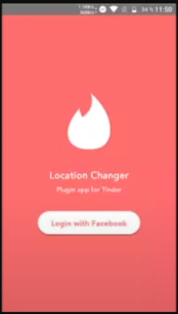

This is a challenge where i were asked to create a login splash screen to simulate a Tinder plugin, as part of a learning challenge using Flutter.

The challenge was taken from this YouTube class: https://www.youtube.com/watch?v=9zkKGkFj3qg&list=PLlBnICoI-g-d-J57QIz6Tx5xtUDGQdBFB&index=27
 
Complete Flutter Course Playlist (pt-BR): https://www.youtube.com/playlist?list=PLlBnICoI-g-d-J57QIz6Tx5xtUDGQdBFB

The home screen should look like this:

